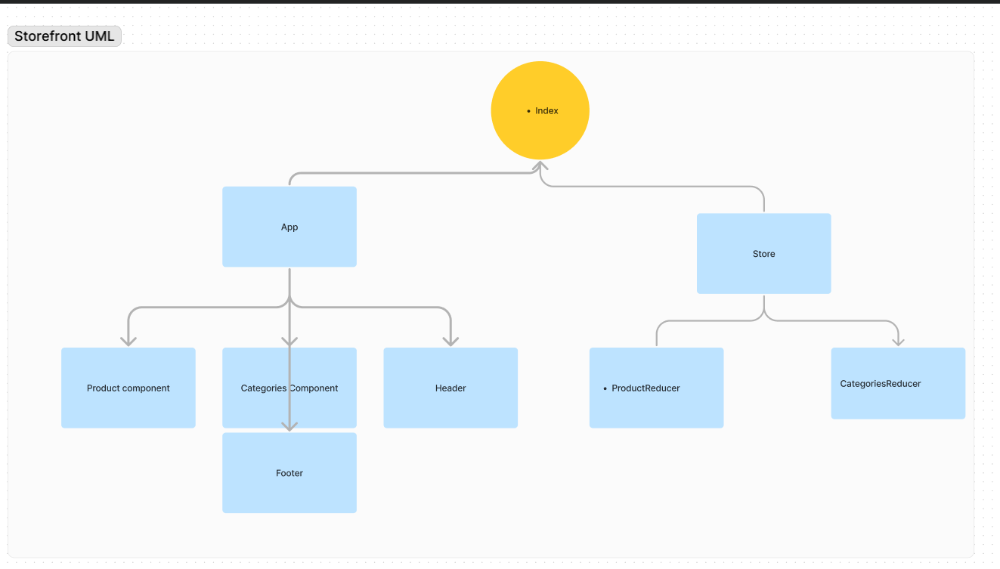

# Virtual Store

Virtual Store is an e-Commerce storefront application built with React and Redux. This project is divided into multiple phases, and this README covers Phase 1 of the project.

## UML: 
- App Component: Container for all sub-components.
- Header Component: Displays the store name.
- Footer Component: Displays copyright and contact information.
- Categories Component: Displays a list of categories and dispatches actions.
- Products Component: Displays a list of products based on the active category

## Project Overview

Our application powers an online storefront that allows users to browse product offerings by category, place items in their shopping cart, and check-out when ready to purchase.

## Core Functionality

- Display a list of product categories.
- Display a listing of products for each category when the category is selected.
- From the product listings:
  - Click to view a full detail page about the product.
  - Add the product to the shopping cart.
- Shopping cart (simple version) always visible on the screen.
- Full shopping cart and checkout screen available from main navigation.

## Technical Requirements

- React for UI.
- ES6 Classes.
- Redux Store for application state management.
- Deployed API with MongoDB storage for categories and products.
- Superagent or Axios for API requests.
- Material UI for layout and styling.
- Test Driven Development using Jest.

## Components

- **App**: The main container for all components.
- **Header**: Displays the store name.
- **Footer**: Displays copyright and contact information.
- **Categories**: Displays a list of categories and dispatches an action when a category is selected.
- **Products**: Displays a list of products based on the selected category.

## Redux Store

- **State Structure**:
  - `categories`: List of categories.
  - `activeCategory`: The currently selected category.
  - `products`: List of products.

- **Actions**:
  - `setActiveCategory`: Sets the active category.
  - `setProductsForCategory`: Sets the products for the active category.

- **Reducers**:
  - `categoriesReducer`: Manages the list of categories.
  - `activeCategoryReducer`: Manages the active category.
  - `productsReducer`: Manages the list of products.

## Development Process and Milestones

### Phase 1: Application Setup

- Basic React Application.
- Redux State Management.
- State managed in memory.
- Material UI Components & Styling.

### Phase 2: Shopping Cart

- Add items to a shopping cart.
- Update quantities.
- Remove items from the cart.
- Show the cart in real-time on the UI.

### Phase 3: Live Data

- Connect the application to a live API.
- Persist changes to products based on cart activity.

### Phase 4: Checkout & Detail Pages

- Refactor the store to use the latest Redux design pattern (Redux Toolkit).
- Add a cart checkout page.
- Add a product details page.